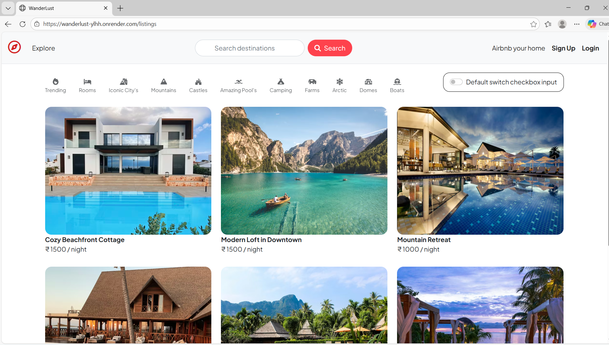
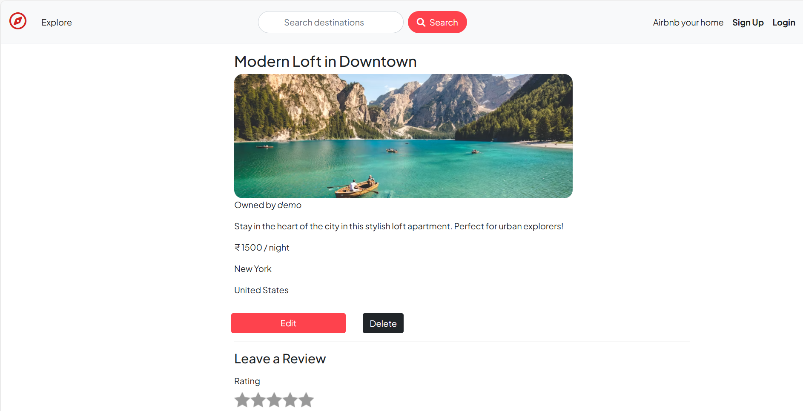
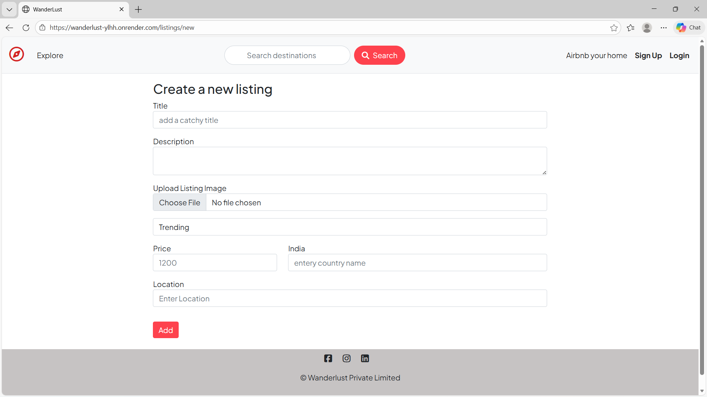
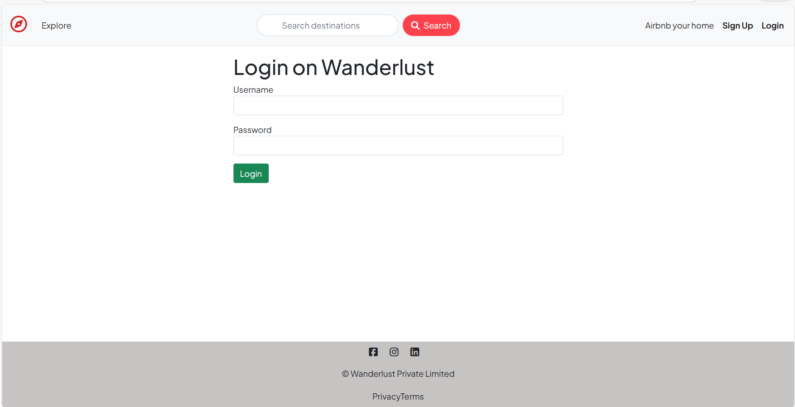
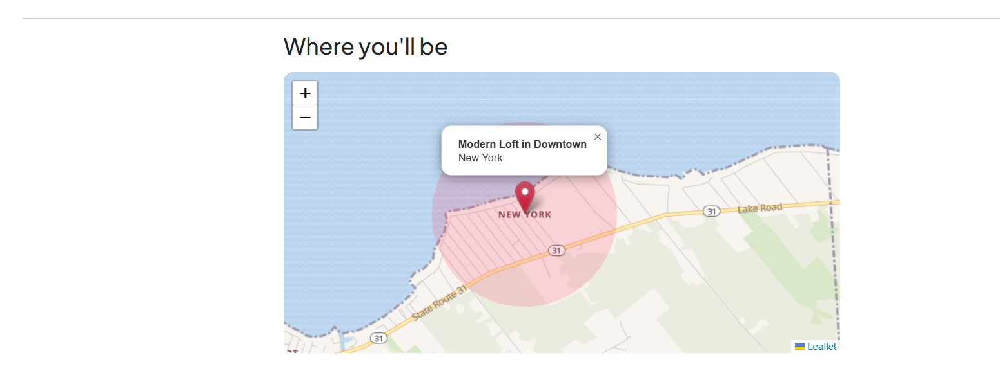
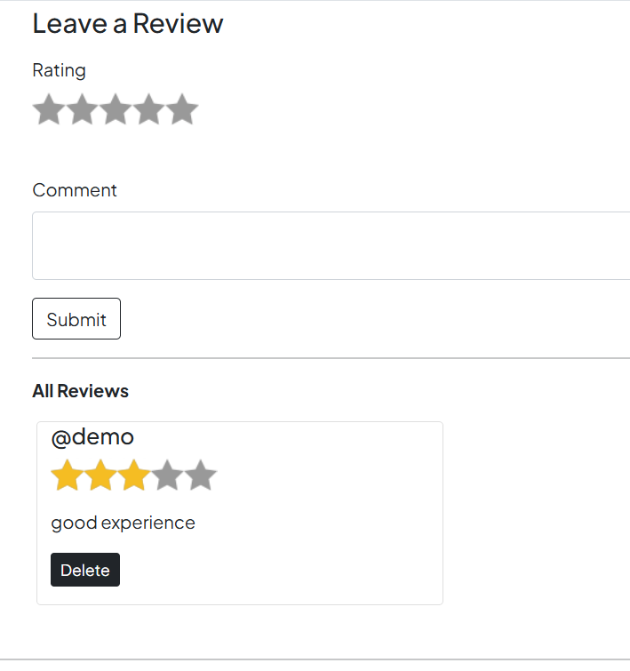

# 🌍 WanderLust – Travel Listing Web App

An Airbnb-inspired full-stack travel listing platform where users can explore destinations, create listings, upload images, and share reviews.

🚀 Built as a major project to gain hands-on experience in real-world backend architecture, authentication, RESTful APIs, and deployment.

---

## 🔗 Live Demo
👉 https://wanderlust-ylhh.onrender.com/listings

---

## 🛠️ Tech Stack

### Frontend
- EJS
- CSS
- Bootstrap

### Backend
- Node.js
- Express.js

### Database
- MongoDB Atlas
- Mongoose

### Tools & Services
- Cloudinary – Image upload & storage
- Map API – Location & interactive maps
- Render – Deployment
- Git & GitHub – Version control

---

## ✨ Key Features

- 🔐 User Authentication (Register / Login / Logout)
- 🏡 Create, Edit & Delete Listings
- 🖼️ Image Upload with Cloudinary
- 📍 Interactive Map with Location Marker
- ⭐ Review & Rating System
- 🔎 Category-Based Filtering
- 📱 Fully Responsive UI

---

## 🎯 What This Project Demonstrates

- Full-stack development using MVC architecture
- RESTful routing
- Secure authentication & session management
- Database schema design & relationships
- Image handling with external storage
- Production deployment on Render

---

## ⚙️ Installation & Setup

### 1️⃣ Clone the repository

```bash
git clone https://github.com/Ankita4508/wanderlust.git
cd wanderlust

```
---

## 2️⃣ Install dependencies
```bash
npm install
```
--- 

## 3️⃣ Create a .env file in the root directory

```bash
ATLASDB_URL=your_mongodb_connection
CLOUDINARY_CLOUD_NAME=xxxx
CLOUDINARY_KEY=xxxx
CLOUDINARY_SECRET=xxxx
MAP_API_KEY=xxxx
SESSION_SECRET=your_secret
```

---

## 4️⃣ Run the application

```bash
node app.js
```

---

## 📍 App will run on:

```bash
http://localhost:8080
```

---

## 📂 Folder Structure
- models/     → Database schemas
- routes/     → Express routes
- views/      → EJS templates
- public/     → Static assets (CSS, JS, images)
- utils/      → Custom utilities & middleware
- app.js      → Main server file

---

## 🚀 Future Enhancements

- 💳 Online booking & payment integration
- ❤️ Wishlist functionality
- 🔍 Advanced search & filters
- 📅 Availability management

---

## 👩‍💻 Author

### Ankita Sunil Sakhare
- GitHub: https://github.com/Ankita4508
- LinkedIn: https://www.linkedin.com/in/ankita-sakhare0024/

---

## 📸 Screenshots

### 🏠 Home Page


### 📍 Review View


### ➕ Create Listing


### 🔐 Login Page


### 📍 Map View


### 📍 Review View
